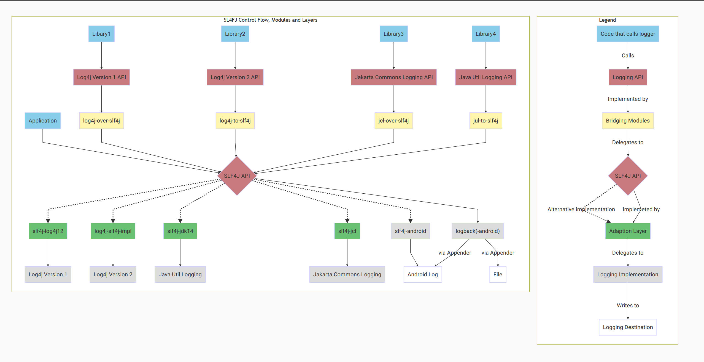

logback-android-demo
====================

 

This example belongs to an article published in Java Magazin 9.17: [Android Logging for Java Professionals – SLF4J and Logback in Android](https://www.triology.de/en/blog-entries/slf4j-and-logback-android).  
The original article (:de:) can be found here: [Android Logging für Java-Profis – SLF4J und Logback in Android](https://www.triology.de/wp-content/uploads/2017/09/Sonderdruck_Triology_JM9_17_Schnatterer_Android-Logging-fuer-Java-Profis.pdf).

An example that shows some possibilities of using [logback-android](http://tony19.github.io/logback-android/):
- The app issues log statements when pressing a button and displays those in a the main text view (see [MainActivity](app/src/main/java/info/schnatterer/logbackandroiddemo/MainActivity.java)).
- There is an exemplary [logback.xml](app/src/main/assets/logback.xml),
  - writing to a file (that is rolled over daily) and
  - logcat. It also
  - forwards JUL to SLF4J/logback.
- The app also provides a [PreferencesDeveloperActivity](app/src/main/java/info/schnatterer/logbackandroiddemo/PreferencesDeveloperActivity.java) / [preferences_developer.xml](app/src/main/res/xml/preferences_developer.xml) that allows for
  - Setting the root/logcat levels at runtime
  - Opening the current logfile in an editor: [OpenLogActivity](app/src/main/java/info/schnatterer/logbackandroiddemo/OpenLogActivity.java)
  - Sending all logfiles via email: [SendLogActivity](app/src/main/java/info/schnatterer/logbackandroiddemo/SendLogActivity.java)
- The central logback-android logic is encapsulated in a separate JAR file: [logback-android-utils](https://github.com/schnatterer/logback-android-utils)

 ## Logback android in the Context of SLF4J  
 
 
 ([created using mermaid](https://mermaidjs.github.io/mermaid-live-editor/#/view/CiAgICUlIFNMNEZKIEJyaWRnZXMgYW5kIEFkYXB0ZXJzCiAgICBncmFwaCBURAoKICAgIHN1YmdyYXBoIEtleQogICAgQ29kZVRoYXRXcml0ZXNUb0xvZ1siQ29kZSB0aGF0IHdyaXRlcyB0byBsb2ciXQotLUNhbGxzLS0+TG9nZ2luZ0FQSXNbTG9nZ2luZyBBUEldCiAgICBMb2dnaW5nQVBJcyAtLUltcGxlbWVudGVkIGJ5IC0tPiBCcmlkZ2luZ0xheWVyW0JyaWRnaW4gTGF5ZXJdCiAgICBCcmlkZ2luZ0xheWVyIC0tIERlbGVnYXRlcyB0byAtLT4gU0xGNEpLZXl7U0xGNEogQVBJfQpTTEY0SktleSAtLiBBbHRlcm5hdGl2ZSBpbXBsZW1lbnRhdGlvbiAuLT4gQWRhcHRpb25MYXllcgogICAgU0xGNEpLZXkgLS1JbXBsZW1ldGVkIGJ5IC0tPiBBZGFwdGlvbkxheWVyCiAgICBBZGFwdGlvbkxheWVyW0FkYXB0aW9uIExheWVyXSAtLSBEZWxlZ2F0ZXMgdG8gLS0+IExvZ2dpbmdJbXBsZW1lbnRhdGlvbgogICAgTG9nZ2luZ0ltcGxlbWVudGF0aW9uW0xvZ2dpbmcgSW1wbGVtZW50YXRpb25dIC0tIFdyaXRlcyB0byAtLT4KTG9nZ2luZ0Rlc3RpbmF0aW9uW0xvZ2dpbmcgRGVzdGluYXRpb25dCiAgICBlbmQKCiAgICBzdWJncmFwaCBTTDRGSiBCcmlkZ2VzIGFuZCBBZGFwdGVycwogICAgQXBwbGljYXRpb24gLS0+IFNMRjRKe1NMRjRKIEFQSX0KICAgIExpYmFyeTEgLS0+IExPRzRKMUFQSVsiTG9nNGogVmVyc2lvbiAxIEFQSSJdCiAgICBMT0c0SjFBUEkgLS0+IGxvZzRqLW92ZXItc2xmNGoKICAgIGxvZzRqLW92ZXItc2xmNGogLS0+IFNMRjRKCiAgICBMaWJyYXJ5MiAtLT4gTE9HNEoyQVBJWyJMb2c0aiBWZXJzaW9uIDIgQVBJIl0KICAgIExPRzRKMkFQSSAtLT4gbG9nNGotdG8tc2xmNGoKICAgIGxvZzRqLXRvLXNsZjRqLS0+IFNMRjRKCiAgICBMaWJyYXJ5MyAtLT4gSkNMQVBJWyJKYWthcnRhIENvbW1vbnMgTG9nZ2luZyBBUEkiXQogICAgSkNMQVBJIC0tPiBqY2wtb3Zlci1zbGY0agogICAgamNsLW92ZXItc2xmNGogLS0+IFNMRjRKCiAgICBMaWJyYXJ5NCAtLT4gSlVMQVBJWyJKYXZhIFV0aWwgTG9nZ2luZyBBUEkiXQogICAgSlVMQVBJIC0tPiBqdWwtdG8tc2xmNGoKICAgIGp1bC10by1zbGY0aiAtLT4gU0xGNEoKCiAgICBTTEY0SiAtLT4gbG9nYmFja1sibG9nYmFjaygtYW5kcm9pZCkiXQogICAgU0xGNEogLS4tPiBzbGY0ai1sb2c0ajEyCiAgICBTTEY0SiAtLi0+IGxvZzRqLXNsZjRqLWltcGwtMi4wCiAgICBTTEY0SiAtLi0+IHNsZjRqLWpkazE0CiAgICBTTEY0SiAtLi0+IHNsZjRqLWpjbAogICAgU0xGNEogLS4tPiBzbGY0ai1hbmRyb2lkCgogICAgc2xmNGotbG9nNGoxMiAtLT4gTE9HNEoxWyJMb2c0aiBWZXJzaW9uIDEiXQogICAgbG9nNGotc2xmNGotaW1wbC0yLjAgLS0+IExPRzRKMlsiTG9nNGogVmVyc2lvbiAyIl0KICAgIHNsZjRqLWpkazE0IC0tPiAgSlVMWyJKYXZhIFV0aWwgTG9nZ2luZyJdCiAgICBzbGY0ai1qY2wgLS0+IEpDTFsiSmFrYXJ0YSBDb21tb25zIExvZ2dpbmciXQogICAgc2xmNGotYW5kcm9pZCAtLT4gQW5kcm9pZFtBbmRyb2lkIExvZ10KCiAgICBsb2diYWNrIC0tIHZpYSBBcHBlbmRlci0tPiBGaWxlCiAgICBsb2diYWNrIC0tIHZpYSBBcHBlbmRlci0tPiBBbmRyb2lkCiAgICBlbmQKCiAgICAlJSBTdHlsZXMKICAgIGNsYXNzRGVmIENvZGVUaGF0V3JpdGVzVG9Mb2cgZmlsbDojODdDRUVCOwogICAgY2xhc3MgQXBwbGljYXRpb24gQ29kZVRoYXRXcml0ZXNUb0xvZzsKICAgIGNsYXNzIExpYmFyeTEgQ29kZVRoYXRXcml0ZXNUb0xvZzsKICAgIGNsYXNzIExpYnJhcnkyIENvZGVUaGF0V3JpdGVzVG9Mb2c7CiAgICBjbGFzcyBMaWJyYXJ5MyBDb2RlVGhhdFdyaXRlc1RvTG9nOwogICAgY2xhc3MgTGlicmFyeTQgQ29kZVRoYXRXcml0ZXNUb0xvZzsKCiAgICBjbGFzc0RlZiBMb2dnaW5nQVBJcyBmaWxsOiNjOTdhN2U7CiAgICBjbGFzcyBTTEY0SiBMb2dnaW5nQVBJczsKICAgIGNsYXNzIExPRzRKMUFQSSBMb2dnaW5nQVBJczsKICAgIGNsYXNzIExPRzRKMkFQSSBMb2dnaW5nQVBJczsKICAgIGNsYXNzIEpDTEFQSSBMb2dnaW5nQVBJczsKICAgIGNsYXNzIEpVTEFQSSBMb2dnaW5nQVBJczsKCiAgICBjbGFzc0RlZiBCcmlkZ2luZ0xheWVyIGZpbGw6I2ZmZjVhZDsKICAgIGNsYXNzIGxvZzRqLW92ZXItc2xmNGogQnJpZGdpbmdMYXllcjsKICAgIGNsYXNzIGxvZzRqLXRvLXNsZjRqIEJyaWRnaW5nTGF5ZXI7CiAgICBjbGFzcyBqY2wtb3Zlci1zbGY0aiBCcmlkZ2luZ0xheWVyOwogICAgY2xhc3MganVsLXRvLXNsZjRqIEJyaWRnaW5nTGF5ZXI7CgogICAgY2xhc3NEZWYgQWRhcHRpb25MYXllciBmaWxsOiM2YWMxNzQ7CiAgICBjbGFzcyBzbGY0ai1sb2c0ajEyIEFkYXB0aW9uTGF5ZXI7CiAgICBjbGFzcyBsb2c0ai1zbGY0ai1pbXBsLTIuMCBBZGFwdGlvbkxheWVyOwogICAgY2xhc3Mgc2xmNGotamRrMTQgQWRhcHRpb25MYXllcjsKICAgIGNsYXNzIHNsZjRqLWpjbCBBZGFwdGlvbkxheWVyOwogICAgY2xhc3Mgc2xmNGotYW5kcm9pZCBBZGFwdGlvbkxheWVyOwoKICAgIGNsYXNzRGVmIExvZ2dpbmdJbXBsZW1lbnRhdGlvbnMgZmlsbDojZGNkY2RjOwogICAgY2xhc3MgbG9nYmFjayBMb2dnaW5nSW1wbGVtZW50YXRpb25zOwogICAgY2xhc3MgTE9HNEoxIExvZ2dpbmdJbXBsZW1lbnRhdGlvbnM7CiAgICBjbGFzcyBMT0c0SjIgTG9nZ2luZ0ltcGxlbWVudGF0aW9uczsKICAgIGNsYXNzIEpVTCBMb2dnaW5nSW1wbGVtZW50YXRpb25zOwogICAgY2xhc3MgSkNMIExvZ2dpbmdJbXBsZW1lbnRhdGlvbnM7CgogICAgY2xhc3NEZWYgTG9nZ2luZ0Rlc3RpbmF0aW9ucyBmaWxsOiNmZmZmZmY7CiAgICBjbGFzcyBGaWxlIExvZ2dpbmdEZXN0aW5hdGlvbnM7CiAgICBjbGFzcyBBbmRyb2lkIExvZ2dpbmdEZXN0aW5hdGlvbnM7CgogICAgJSUgTWFrZSBzdXJlIHN1YnJhcGhzIGhhdmUgd2hpdGUgYmFja2dyb3VuZAogICAgY2xhc3NEZWYgY2x1c3RlciBmaWxsOiNmZmZmZmYKCiAgICAlJSBTdHlsaW5nIGZvciBrZXkKICAgIGNsYXNzIENvZGVUaGF0V3JpdGVzVG9Mb2cgQ29kZVRoYXRXcml0ZXNUb0xvZzsKICAgIGNsYXNzIExvZ2dpbmdBUElzIExvZ2dpbmdBUElzOwogICAgY2xhc3MgQnJpZGdpbmdMYXllciBCcmlkZ2luZ0xheWVyOwogICAgY2xhc3MgU0xGNEpLZXkgTG9nZ2luZ0FQSXM7CiAgICBjbGFzcyBBZGFwdGlvbkxheWVyIEFkYXB0aW9uTGF5ZXI7CiAgICBjbGFzcyBMb2dnaW5nSW1wbGVtZW50YXRpb24gTG9nZ2luZ0ltcGxlbWVudGF0aW9uczsKICAgIGNsYXNzIExvZ2dpbmdEZXN0aW5hdGlvbiBMb2dnaW5nRGVzdGluYXRpb25zOwoK))

## Jenkins
Running [Jenkinsfile](Jenkinsfile) with the [pipeline plugin](https://wiki.jenkins-ci.org/display/JENKINS/Pipeline+Plugin) (tested with version 2.4) requires
- A JDK defined as Jenkins tool  (see [Jenkinsfile](Jenkinsfile) for name of JDK tool)
- Android SDK installed on Jenkins salve, matching the `compileSdkVersion` and `buildToolsVersion` as defined in [app/build.gradle](app/build.gradle)
- Optional: You can add a build parameter `RECIPIENTS` that contains a comma-separated list of all email recipie
